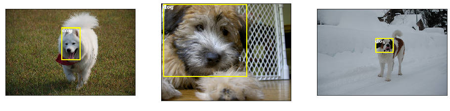

# Object-Detection-with-AWS-Sagemaker

This Project is hugely based on the [Object Detection with Amazon Sagemaker](https://www.coursera.org/projects/object-detection-sagemaker) guided project on coursera, a introductory project shows how to prepare training data, move data from Sagemaker to S3, start training jobs, deploy the model to an endpoint and get results with the deployed model. However, it seems there was a update in AWS API and the code in the tutorial will causes some warnings and errors (See note section for furthur details). Overall, This is a worth-taking course if you are beginner to AWS.

## Preview
### Ground Truth

### Predictions

### Annotation
This is one sample of annotation for training.
```
{'file': 'Birman_173.jpg',
 'categories': [{'class_id': 0, 'name': 'cat'},
  {'class_id': 1, 'name': 'dog'}],
 'image_size': [{'width': 500, 'height': 333, 'depth': 3}],
 'annotations': [{'class_id': 0,
   'left': 207,
   'top': 6,
   'width': 107,
   'height': 106}]}
```

## Note
- It takes about 1 hour to execute all the cells. It takes a lot of time copying training files from Sagemaker to S3 and starting up the training job. To be honest, I don't understand why the it takes so long to perform those tasks.
- In the section testing deploed model there is statement `deployed_model.content_type = 'image/jpeg'` tutorial, it somehow didn't work for me and showed the error message `AttributeError: can't set attribute"`. After spending 3 hours looking for solution, I found the solution in [Sagemeker document](https://sagemaker.readthedocs.io/en/stable/api/inference/predictors.html#sagemaker.predictor.Predictor.predict) that we can specify the data type when inferencing, we provide additional arguments like this ` object_detector.predict(b, initial_args={"ContentType": "image/jpeg"})` to solve the problem.

